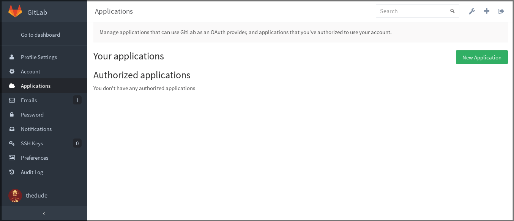
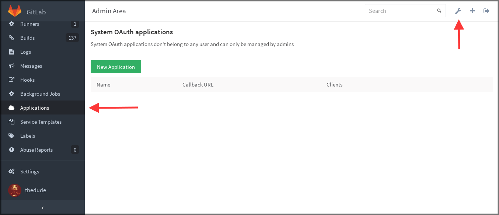

# GitLab as OAuth2 authentication service provider

This document is about using GitLab as an OAuth authentication service provider
to sign in to other services.

If you want to use:

- The [OAuth2](https://oauth.net/2/) protocol to access GitLab resources on user's behalf,
  see [OAuth2 provider](../api/oauth2.md)
- Other OAuth authentication service providers to sign in to
  GitLab, see the [OAuth2 client documentation](omniauth.md).
- The related API, see [Applications API](../api/applications.md).

## Introduction to OAuth

[OAuth](https://oauth.net/2/) provides to client applications a 'secure delegated access' to server
resources on behalf of a resource owner. In fact, OAuth allows an authorization
server to issue access tokens to third-party clients with the approval of the
resource owner, or the end-user.

OAuth is mostly used as a Single Sign-On service (SSO), but you can find a
lot of different uses for this functionality. For example, you can allow users
to sign in to your application with their GitLab.com account, or GitLab.com
can be used for authentication to your GitLab instance
(see [GitLab OmniAuth](gitlab.md)).

The 'GitLab Importer' feature is also using the OAuth protocol to give access
to repositories without sharing user credentials to your GitLab.com account.

GitLab supports two ways of adding a new OAuth2 application to an instance. You
can either add an application as a regular user or add it in the Admin Area.
What this means is that GitLab can actually have instance-wide and a user-wide
applications. There is no difference between them except for the different
permission levels they are set (user/admin). The default callback URL is
`http://your-gitlab.example.com/users/auth/gitlab/callback`

## Adding an application through the profile

In order to add a new application via your profile, navigate to
**Profile Settings > Applications** and select **New Application**.

In the application form, enter a **Name** (arbitrary), and make sure to set up
correctly the **Redirect URI** which is the URL where users are sent after
they authorize with GitLab.

When you click **Submit** you are provided with the application ID and
the application secret which you can then use with your application that
connects to GitLab.

## OAuth applications in the Admin Area

To create an application that does not belong to a certain user, you can create
it from the Admin Area.

You're also able to mark an application as _trusted_ when creating it through the Admin Area. By doing that,
the user authorization step is automatically skipped for this application.

## Authorized applications

Every application you authorized to use your GitLab credentials is shown
in the **Authorized applications** section under **Profile Settings > Applications**.

GitLab's OAuth applications support scopes, which allow various actions that any given
application can perform such as `read_user` and `api`. There are many more scopes
available.

At any time you can revoke any access by just clicking **Revoke**.
